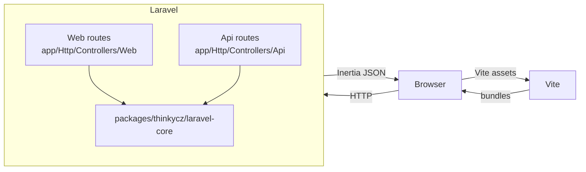
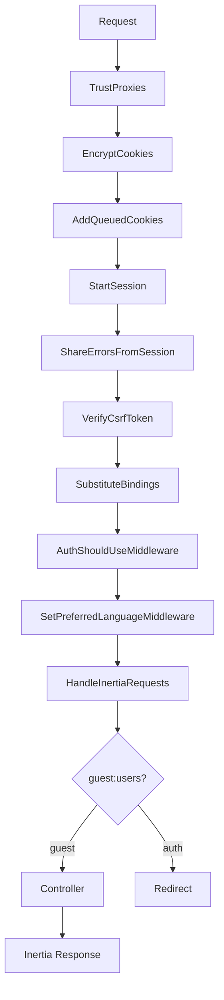
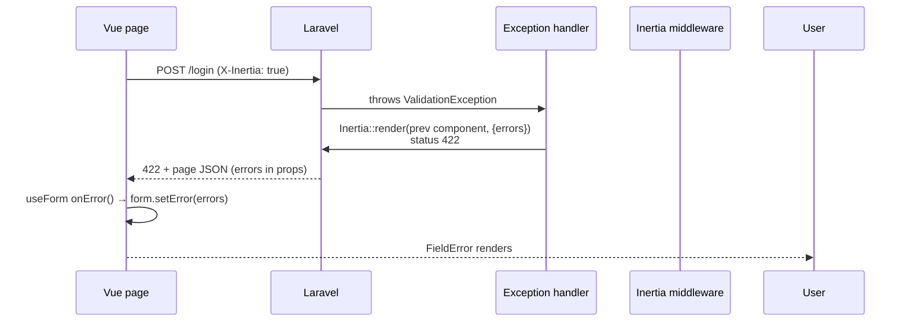
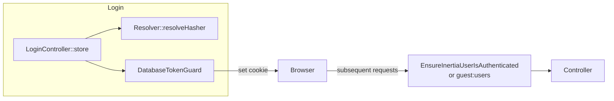

# Architecture

## High-level

This project is a Laravel 13 + Inertia 3 + Vue 3 single-tenant starter. The
backend ships with two HTTP surfaces and one framework helper package; the
frontend is a Vite-built Vue 3 app that consumes Inertia pages from the
backend.



## Middleware chain (web)



`AuthShouldUseMiddleware` and `SetPreferredLanguageMiddleware` come from
`packages/thinkycz/laravel-core`. `HandleInertiaRequests` (in
`app/Http/Middleware/`) extends Inertia's base middleware to share `app`,
`auth`, `flash`, and inherited `errors`.

## Validation-error flow (Inertia v3)



Inertia v3 does **not** auto-follow a bare 302 redirect on POST. The handler
in `bootstrap/app.php` therefore re-renders the previous Inertia component
with status 422 and the `errors` prop, so the Vue client merges errors into
the page and populates `useForm().errors`.

## Authentication



- Cookie is HTTP-only and named via the `database_token` config.
- The guard stores `(user_id, token_hash, expires_at)` in the
  `database_tokens` table.
- `LogoutController::destroy` revokes the token row via
  `$user->databaseTokens()->getQuery()->delete()` before invalidating the
  session.

## Frontend layout

```
resources/js/
├── app.ts                  # Inertia app bootstrap
├── bootstrap.ts            # Axios + CSRF setup
├── components/
│   └── ui/                 # FieldError, FlashAlerts, Select, Input, Button
├── composables/
│   └── useSharedProps.ts   # typed accessor for shared props
├── layouts/
│   ├── AppLayout.vue       # authenticated shell
│   └── AuthLayout.vue      # guest shell
├── lib/                    # framework-agnostic helpers
├── pages/                  # Inertia page components
└── types/
    └── index.ts            # AuthUser, AppMeta, FlashProps, SharedProps
```

Pages import shared props via `useSharedProps()` and render them with the
`ui/` primitives. Forms use `@inertiajs/vue3`'s `useForm()` for typed
client-side state; validation errors arrive via page props after the 422
handshake above.

## Local packages

- `packages/thinkycz/laravel-core/` — the framework helper. Provides
  `Resolver`, `Config`, `Env`, `Typer`, `AuthValidity`, `Thrower`, `Parser`,
  `DatabaseToken`, `EmailBrokerService`, `AuthShouldUseMiddleware`,
  `SetPreferredLanguageMiddleware`, and the
  `Illuminate\Contracts\Debug\ExceptionHandler` binding.

App-level code should not re-implement what core already exposes. Use core
helpers before introducing new ones.

## Storage

- Sessions: file driver in dev, configurable in `config/session.php`. E2e
  dev server runs with `SESSION_SECURE_COOKIE=false` and `APP_ENV=testing`.
- Cache: `array` in tests, `file` in dev, `redis` in production
  (per `config/cache.php`).
- Database: MySQL 8 in production; SQLite `:memory:` in tests.

## Runtime services

MySQL 8, Redis, cron, and supervisor are the production runtime services
declared in `composer.json` / `docker-compose.yml` (when present).

## Internationalization (i18n)

The backend (`lang/*.json`) and frontend (`resources/js/i18n/*.json`) translation files are separate but mirrored. This duplication is a deliberate design tradeoff to keep the frontend independent of API calls for localizing core UI shells during bootstrap. In the long term, they can be consolidated by either exposing a backend localization API endpoint or generating the client JSON files from the server JSON files during a build step.
